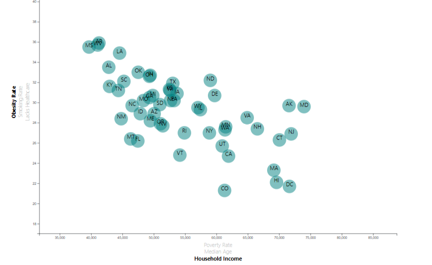

# University of Denver Data Analytics: D2 Project - Data Journalism and D3

# Overview
This assignment consists of creating an interactive scatter plot using D3 and data from the US Census. The data consists of state demographic data including household income, poverty, obesity and healthcare access among others. The challenge is to create a plot that looks at correlations between the data for each state. In addition the scatter plot needs to be responsive so that it can progress back and forth through the data variables.

The data set included with the assignment is based on 2014 ACS 1-year estimates from the [US Census Bureau](https://data.census.gov/cedsci/), but you are free to investigate a different data set. The current data set includes data on rates of income, obesity, poverty, etc. by state. MOE stands for "margin of error."

# Development Toolkit
## JavaScript
## D3
---

## Main Task

Create a scatter plot between two of the data variables such as Healthcare.

* Include state abbreviations in the circles.

* Create and situate your axes and labels to the left and bottom of the chart.

- - -

## Bonus Task

#### 1. More Data, More Dynamics

You're going to include more demographics and more risk factors. Place additional labels in your scatter plot and give them click events so that your users can decide which data to display. Animate the transitions for your circles' locations as well as the range of your axes. Do this for two risk factors for each axis. Or, for an extreme challenge, create three for each axis.

#### 2. Incorporate d3-tip

Add tooltips to your circles and display each tooltip with the data that the user has selected. 

- - -

